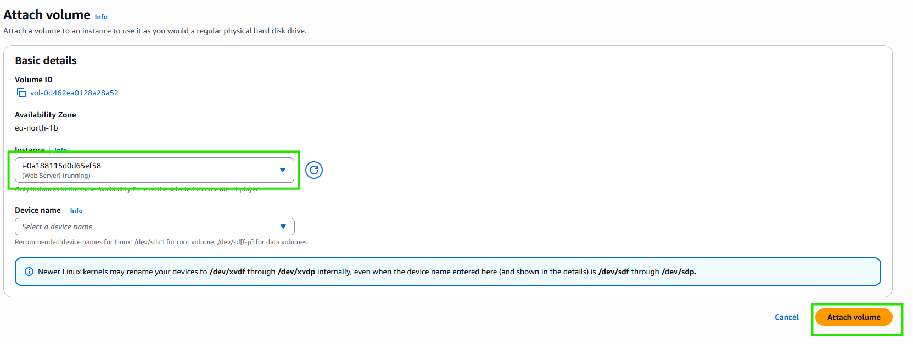
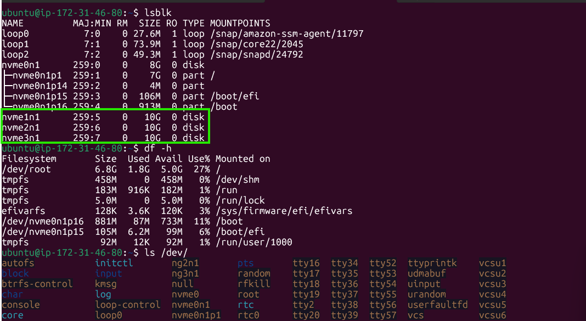
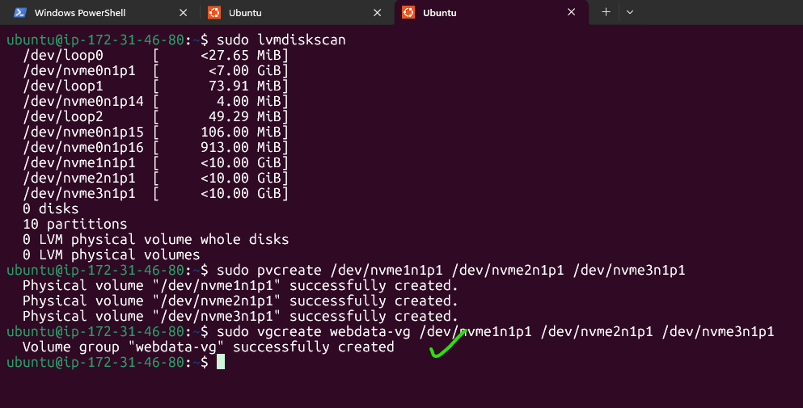
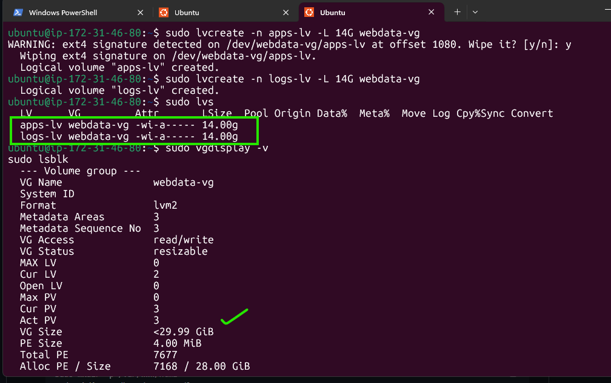
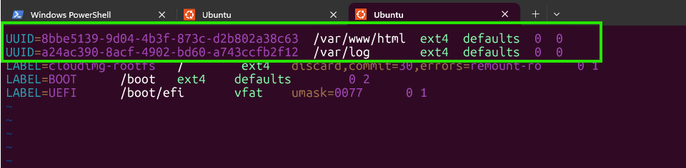
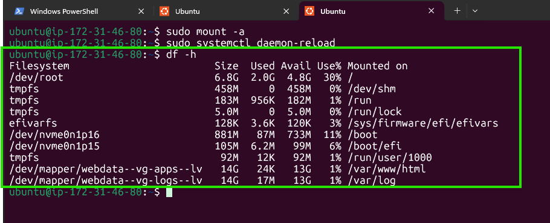
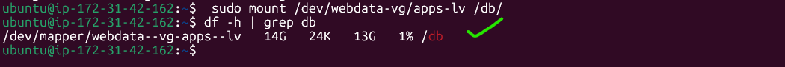

---

# 📘 Web Solution with WordPress (3-Tier Architecture)

This project demonstrates deploying a **WordPress Web Solution** using a **three-tier architecture** with **RedHat Linux** or **Ubuntu EC2 instances** on AWS.

You will configure storage subsystems, deploy a **WordPress web server**, set up a **remote MySQL database server**, and connect them to complete the full-stack deployment.

> **Note:** This guide provides commands for both **RedHat/CentOS** and **Ubuntu/Debian** distributions. Choose the appropriate commands for your chosen OS.

---

## 📂 Project Overview

* **Presentation Layer (PL):** Browser or client accessing WordPress.
* **Business Layer (BL):** Apache Web Server running WordPress on RedHat.
* **Data Layer (DL):** MySQL database hosted on a separate RedHat EC2 instance.

---

## 🖥️ Architecture Setup

* **Client:** Your Laptop/PC (web browser).
* **Web Server:** EC2 RedHat/Ubuntu instance (runs Apache + PHP + WordPress).
* **Database Server:** EC2 RedHat/Ubuntu instance (runs MySQL).

---

## ⚙️ Step 1 — Prepare the Web Server

1. Launch a RedHat EC2 instance (**Web Server**).
2. Create **3 x 10 GiB EBS volumes** in the same AZ.
3. Attach volumes to your Web Server EC2.

     
 
  * On older instance types, volumes usually show up as /dev/xvdf, /dev/xvdg, /dev/xvdh.

  * On most recent AWS instance types (with NVMe storage), volumes appear as /dev/nvme1n1, /dev/nvme2n1, /dev/nvme3n1.

👉 Always run: step 4

4. Verify attached volumes:

   ```bash
   lsblk
   df -h
   ls /dev/
   ```
5. Partition each disk using `gdisk`:

   ```bash
   sudo gdisk /dev/nvme1n1
   sudo gdisk /dev/nvme2n1
   sudo gdisk /dev/nvme3n1
   ```

     

   **For each disk, follow these steps in `gdisk`:**

   1. **Create a new partition:**
      - Press `n` (new partition)
      - Partition number → press **Enter** (default: 1)
      - First sector → press **Enter** (default, start of disk)
      - Last sector → press **Enter** (default, use full disk)
      - Hex code → type `8E00` (Linux LVM)

    2. **Write partition table:**
       - Press `w` (write)
       - Confirm with `y`

    3. **Exit gdisk:**
       - Press `q` (quit)

   **Verify partitions:**

   ```bash
   lsblk
   ```

   Expected output:

    ```
    nvme1n1    259:5    0   10G  0 disk
    └─nvme1n1p1
    nvme2n1    259:6    0   10G  0 disk
    └─nvme2n1p1
    nvme3n1    259:7    0   10G  0 disk
    └─nvme3n1p1
   ```


6. Install LVM:

   **RedHat/CentOS:**
   ```bash
   sudo yum install -y lvm2
   sudo lvmdiskscan
   ```

   **Ubuntu/Debian:**
   ```bash
   sudo apt update
   sudo apt install -y lvm2
   sudo lvmdiskscan
   ```
7. Create Physical Volumes:

   ```bash
   sudo pvcreate /dev/nvme1n1p1 /dev/nvme2n1p1 /dev/nvme3n1p1
   sudo pvs
   ```
8. Create Volume Group:

   ```bash
   sudo vgcreate webdata-vg /dev/nvme1n1p1 /dev/nvme2n1p1 /dev/nvme3n1p1
   sudo vgs
   ```
     

9. Create Logical Volumes:

   ```bash
   sudo lvcreate -n apps-lv -L 14G webdata-vg
   sudo lvcreate -n logs-lv -L 14G webdata-vg
   sudo lvs
   ```
10. Verify setup:

    ```bash
    sudo vgdisplay -v
    sudo lsblk
    ```
     
     
11. Format partitions:

    ```bash
    sudo mkfs.ext4 /dev/webdata-vg/apps-lv
    sudo mkfs.ext4 /dev/webdata-vg/logs-lv
    ```
12. Create mount points:

    ```bash
    sudo mkdir -p /var/www/html
    sudo mkdir -p /home/recovery/logs
    ```
13. Mount volumes:

    ```bash
    sudo mount /dev/webdata-vg/apps-lv /var/www/html
    sudo rsync -av /var/log/ /home/recovery/logs/
    sudo mount /dev/webdata-vg/logs-lv /var/log
    sudo rsync -av /home/recovery/logs/ /var/log
    ```
14. Persist mounts in `/etc/fstab`:

    ```bash
    sudo blkid
    ```
     

    * Edit /etc/fstab:
    
    ```bash
     sudo vi /etc/fstab
    ```
    Example:

    ```
    UUID=<apps-lv-UUID> /var/www/html ext4 defaults 0 0
    UUID=<logs-lv-UUID> /var/log ext4 defaults 0 0
    ```
     

15. Reload mounts:

    ```bash
    sudo mount -a
    sudo systemctl daemon-reload
    df -h
    ```
     
---

## ⚙️ Step 2 — Prepare the Database Server

1. Launch another RedHat EC2 instance (**DB Server**).
2. Create **3 x 10 GiB EBS volumes** and attach them.
3. Repeat the same partitioning and LVM setup as the Web Server.
4. Create **db-lv** logical volume and mount to `/db`:

   ```bash
   sudo mkdir -p /db
   sudo mount /dev/webdata-vg/apps-lv /db/
   df -h | grep db
   ```
      
---

## ⚙️ Step 3 — Install WordPress on Web Server

1. Update packages:

   ```bash
   sudo yum -y update
   ```
2. Install Apache, PHP, and dependencies:

   **RedHat/CentOS:**
   ```bash
   sudo yum -y install wget httpd php php-mysqlnd php-fpm php-json
   sudo systemctl enable httpd
   sudo systemctl start httpd
   ```

   **Ubuntu/Debian:**
   ```bash
   sudo apt update
   sudo apt install -y wget apache2 php php-mysql php-fpm php-json
   sudo systemctl enable apache2
   sudo systemctl start apache2
   ```
3. Enable PHP 7.4:

   **RedHat/CentOS (Remi repo):**
   ```bash
   sudo yum install -y https://dl.fedoraproject.org/pub/epel/epel-release-latest-8.noarch.rpm
   sudo yum install -y yum-utils http://rpms.remirepo.net/enterprise/remi-release-8.rpm
   sudo yum module reset php
   sudo yum module enable php:remi-7.4
   sudo yum install -y php php-opcache php-gd php-curl php-mysqlnd
   sudo systemctl start php-fpm
   sudo systemctl enable php-fpm
   setsebool -P httpd_execmem 1
   sudo systemctl restart httpd
   ```

   **Ubuntu/Debian:**
   ```bash
   sudo apt install -y software-properties-common
   sudo add-apt-repository ppa:ondrej/php
   sudo apt update
   sudo apt install -y php7.4 php7.4-opcache php7.4-gd php7.4-curl php7.4-mysql php7.4-fpm
   sudo systemctl start php7.4-fpm
   sudo systemctl enable php7.4-fpm
   sudo a2enmod proxy_fcgi setenvif
   sudo a2enconf php7.4-fpm
   sudo systemctl restart apache2
   ```
4. Install WordPress:

   ```bash
   mkdir wordpress && cd wordpress
   sudo wget http://wordpress.org/latest.tar.gz
   sudo tar -xzvf latest.tar.gz
   sudo rm -rf latest.tar.gz
   cp wordpress/wp-config-sample.php wordpress/wp-config.php
   cp -R wordpress /var/www/html/
   ```
5. Set permissions:

   ```bash
   sudo chown -R apache:apache /var/www/html/wordpress
   sudo chcon -t httpd_sys_rw_content_t /var/www/html/wordpress -R
   sudo setsebool -P httpd_can_network_connect=1
   ```

---

## ⚙️ Step 4 — Install MySQL on Database Server

1. Install MySQL:

   **RedHat/CentOS:**
   ```bash
   sudo yum -y update
   sudo yum install -y mysql-server
   sudo systemctl restart mysqld
   sudo systemctl enable mysqld
   ```

   **Ubuntu/Debian:**
   ```bash
   sudo apt update
   sudo apt install -y mysql-server
   sudo systemctl restart mysql
   sudo systemctl enable mysql
   ```
2. Configure WordPress DB:

   ```bash
   sudo mysql
   CREATE DATABASE wordpress;
   CREATE USER 'myuser'@'<Web-Server-Private-IP>' IDENTIFIED BY 'mypass';
   GRANT ALL ON wordpress.* TO 'myuser'@'<Web-Server-Private-IP>';
   FLUSH PRIVILEGES;
   SHOW DATABASES;
   exit;
   ```

---

## ⚙️ Step 5 — Connect WordPress to Remote Database

1. Install MySQL client on Web Server:

   **RedHat/CentOS:**
   ```bash
   sudo yum install -y mysql
   mysql -u myuser -p -h <DB-Server-Private-IP>
   SHOW DATABASES;
   ```

   **Ubuntu/Debian:**
   ```bash
   sudo apt install -y mysql-client
   mysql -u myuser -p -h <DB-Server-Private-IP>
   SHOW DATABASES;
   ```
2. Edit WordPress config:

   ```bash
   sudo vi /var/www/html/wordpress/wp-config.php
   ```

   Update:

   ```php
   define('DB_NAME', 'wordpress');
   define('DB_USER', 'myuser');
   define('DB_PASSWORD', 'mypass');
   define('DB_HOST', '<DB-Server-Private-IP>');
   ```
3. Open security groups:

   * Web Server: Allow **HTTP (80)** from `0.0.0.0/0`.
   * DB Server: Allow **MySQL (3306)** only from Web Server’s **private IP**.

---

## 🌐 Step 6 — Access WordPress

Open in your browser:

```
http://<Web-Server-Public-IP>/wordpress/
```

* Complete the WordPress setup by entering site title, username, and password.

If you see the installation screen → 🎉 **SUCCESS** 🎉

---

## ⚠️ Post-Project Notes

* Stop your EC2 instances after testing to avoid extra AWS costs.
* This project covers:

  * Disk management with **gdisk + LVM**.
  * Deploying **WordPress CMS** with **remote MySQL DB**.
  * Configuring a **3-tier architecture** on AWS.

---

✅ **Congratulations!** You have deployed a full-scale web solution with WordPress & MySQL on AWS EC2 using RedHat Linux or Ubuntu.

---

